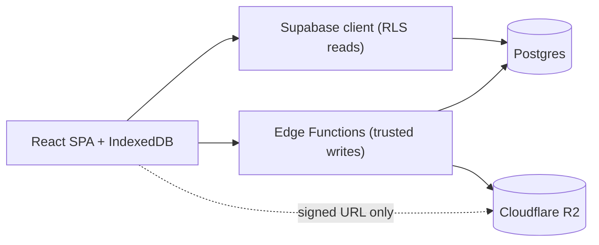
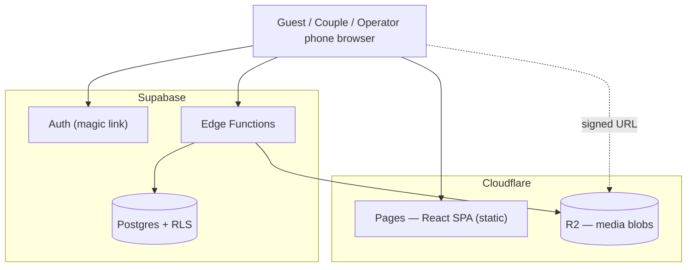
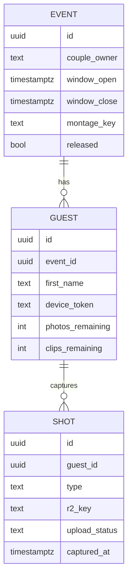

# Architecture Spine — dispo-retro-cam

## Design Paradigm

**Local-first SPA over Backend-as-a-Service, with a thin trusted-function boundary.**

- The **client** (React SPA) is the center of gravity: it captures, stores durably to the device, and renders. It must keep working with no network.
- **Supabase** is the backend for data (Postgres), identity (Auth), and authorization (Row-Level Security). The client reads through it directly, always RLS-scoped.
- A **thin trusted boundary** — Supabase **Edge Functions** — owns the few operations the client can't be trusted with (issuing media-upload permission, enforcing quotas, closing the event, releasing media). Nothing privileged happens in the client.
- **Media blobs** live in Cloudflare R2, never in Postgres; the database holds only metadata and object keys.

Layer → home:
| Layer | Home |
| --- | --- |
| UI + capture + local buffer | `src/` (React SPA), IndexedDB |
| Data reads / identity | Supabase client (RLS-scoped) |
| Trusted writes | Supabase Edge Functions (`supabase/functions/`) |
| Blob storage | Cloudflare R2 |

## Invariants & Rules

### AD-1 — Capture is durable before it is uploaded  `[ADOPTED]`
- **Binds:** NFR1, FR5, FR6
- **Prevents:** a feature treating "captured" as "uploaded" and losing shots on weak venue wifi.
- **Rule:** On shutter, the (compressed) media is written to IndexedDB **synchronously, before any network call**, and is renderable from local storage. Upload is a separate, retrying background step. Closing the tab must not lose an already-captured shot. No feature may gate capture on connectivity.

### AD-2 — Media is private; access only via short-lived signed URLs
- **Binds:** FR11, FR12, FR13, FR14, NFR3
- **Prevents:** a public/guessable media URL leaking the couple's-eyes-only collection.
- **Rule:** R2 objects are never public. Every read or write of a blob uses a short-lived signed URL issued **after** an authorization check. A guest may be issued URLs only for their own roll; couple/operator for the whole event. R2 credentials never reach the client.

### AD-3 — Reads via RLS client; privileged writes via Edge Functions only
- **Binds:** all
- **Prevents:** two features writing the same entity through different paths with different validation.
- **Rule:** Client **reads** go through the Supabase client, scoped by RLS to the caller's tier. Any write that grants access, spends quota, or changes event/release state goes through an **Edge Function** — never a direct client write. Ordinary metadata a guest owns (e.g. their name) may be written directly only where an RLS policy fully constrains it.

### AD-4 — The 25/5 allotment is server-authoritative
- **Binds:** FR3, FR7, FR8
- **Prevents:** a client (buggy or tampered) granting itself more than 25 photos / 5 clips.
- **Rule:** The Edge Function that issues each upload URL is the enforcement point: it checks the guest's remaining count and **rejects overage**. The client-side counter is UX only and is never the authority.

### AD-5 — Two identity tiers, RLS-scoped
- **Binds:** FR2, FR11, FR12, FR13, FR18, NFR3
- **Prevents:** a guest reaching another guest's roll or the full collection; the couple's private view leaking.
- **Rule:** **Guests** are unauthenticated, identified by an opaque per-device join token. The guest row **and its allotment are created server-side by a `join-event` Edge Function** (the client never fabricates a guest or its quota); the function returns the token, which the client stores. RLS scopes a guest to their own roll only. **Couple and Operator** authenticate via Supabase Auth **magic link**; RLS grants couple = read-all-of-their-event + set release, operator = manage event + download-all. No guest path can read across rolls.

### AD-6 — Single-owner data model
- **Binds:** FR3, FR13, all data
- **Prevents:** ambiguous ownership / two-writer conflicts over a shot or roll.
- **Rule:** `Event 1—N Guest 1—N Shot`. Every Shot belongs to exactly one Guest; every Guest to one Event. Postgres holds metadata + R2 keys + attribution; blobs live only in R2. No entity has two owners.

### AD-7 — The app does not edit video
- **Binds:** FR15, FR16, FR17, FR18
- **Prevents:** montage-editing scope leaking into the app and threatening the November ship.
- **Rule:** The app's montage responsibility is exactly two things: (a) a **bulk download-all** for the operator to edit externally, and (b) **hosting one finished montage video** per event as the reveal asset the couple plays. In-app/auto montage generation is out of scope for MVP.

### AD-8 — Retro effect is baked on photos client-side; video stays light
- **Binds:** FR9, NFR1
- **Prevents:** heavy on-device video processing undermining capture reliability and battery.
- **Rule:** The retro treatment (grain, warm grade, burned-in date stamp) is applied to **photos** on-device at capture and baked into the stored image. **Video** receives only a light grade / date stamp for MVP; richer video effects are deferred. Retro processing must never block or delay the durable-write in AD-1.

**Dependency direction** (who may depend on whom — arrows point to the dependency; nothing depends back on the client):



## Consistency Conventions

| Concern | Convention |
| --- | --- |
| Naming — entities | `Event`, `Guest`, `Shot` (singular); Postgres tables snake_case plural (`events`, `guests`, `shots`). |
| Naming — files | React components PascalCase (`CameraScreen.tsx`); hooks `useX.ts`; Edge Functions kebab (`issue-upload-url`). |
| IDs | UUID v4 for all entities; R2 object key = `events/<eventId>/<guestId>/<shotId>` plus the file extension. |
| Dates | Store UTC ISO-8601; the burned-in date stamp is the event-local date, display-only. |
| Shot media | `type` ∈ `photo` \| `clip`; `upload_status` ∈ `local` \| `uploaded`; client compresses before both store and upload. |
| Errors (Edge Functions) | JSON `{ error: { code, message } }`; never leak R2 creds or internal detail. |
| Auth / state | Guest = opaque token in localStorage; couple/operator = Supabase Auth session. All authorization via RLS + Edge Function checks, never client trust. |
| Config / secrets | R2 keys + service role live only in Edge Function env; client gets only the anon key + public URL. |

## Stack

| Name | Version |
| --- | --- |
| Node.js | 22 LTS (Node 20 EOL Apr 2026) |
| React | 19.2.x |
| Vite | 8.0.x |
| TypeScript | current 5.x |
| @supabase/supabase-js | 2.113.x |
| Supabase (Postgres, Auth, Edge Functions, RLS) | hosted, current |
| Cloudflare R2 (media) + Pages (SPA hosting) | current |
| Browser APIs | getUserMedia / MediaRecorder (capture), IndexedDB (durable buffer), Canvas (retro on photos) |

## Structural Seed

**Containers & deployment envelope:**



Single production environment + local dev; no staging. Guest QR encodes the Pages URL + event token.

**Core entities:**



**Source tree (scaffold, not a mirror):**

```text
dispo-retro-cam/
  src/
    screens/        # G1-G4 guest, C1-C2 couple, O1-O2 operator (per EXPERIENCE.md IA)
    capture/        # getUserMedia, compression, retro canvas, IndexedDB buffer, upload queue
    lib/            # supabase client, api wrappers, auth
    ui/             # DESIGN.md components (shutter, counter, dateStamp, filmFrame, ...)
  supabase/
    functions/      # join-event (creates guest+allotment, AD-5), issue-upload-url (enforces AD-4), close-event, set-release, download-all
    migrations/     # events, guests, shots + RLS policies
  public/
```

## Capability → Architecture Map

| Capability / Area | Lives in | Governed by |
| --- | --- | --- |
| QR → no-install capture (FR1, FR5–8) | `src/screens` + `src/capture` | AD-1, paradigm |
| Name + allotment (FR2, FR3) | join flow + `guests` table | AD-4, AD-5, AD-6 |
| Offline safety (NFR1) | `src/capture` IndexedDB + upload queue | AD-1 |
| Own-roll view / privacy (FR11, FR12) | `src/screens` (G3) + RLS | AD-2, AD-5 |
| Private collection + reveal (FR13–16) | `src/screens` (C1, C2) | AD-2, AD-5, AD-7 |
| Montage host + download-all (FR17, FR18) | `supabase/functions` + operator screens | AD-7 |
| Retro look (FR9) | `src/capture` canvas | AD-8 |
| Media storage/cost (NFR4) | Cloudflare R2 + client compression | AD-2, AD-8 |

## Deferred

- **Auto-fallback montage reel** — post-MVP; hero hand-edited cut ships first (AD-7).
- **Rich video retro effects** — deferred; reliability first (AD-8).
- **Android background-sync upload** — not built; honest-foreground posture chosen (AD-1).
- **Public release mechanism / long-term retention & purge job** — flagged in PRD open questions; decide before launch, not a structural blocker now.
- **Installable-PWA / push** — not needed for a one-shot event; plain mobile web.
- **Exact compression thresholds & retro intensity** — tune at build against real device output (AD-8 assumption).
